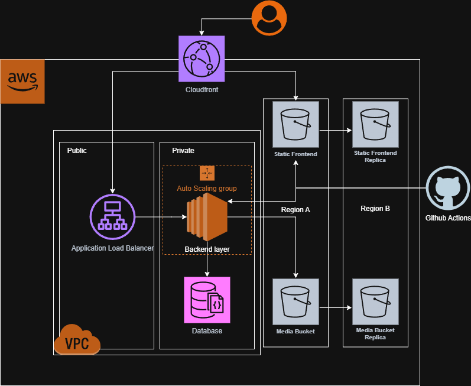

# Media Sharing Application - AWS Infrastructure

This repo contains the Terraform code for a scalable, secure, and highly available AWS infrastructure designed to host a media sharing application. The infrastructure is written in Terraform and is ready for application deployment using GitHub Actions.

## Architecture Diagram



\*A high-level overview of the architecture, illustrating the flow of traffic from the user through CloudFront and the ALB to the backend services, as well as the interaction with the database and the media S3 bucket.

## Features

### High Availability & Scalability

- **Multi-AZ Deployment:** The entire network and application infrastructure is deployed across two AZs.
- **Auto Scaling Backend:** The backend EC2 instances are managed by an Auto Scaling Group.
- **Load Balancing:** An Application Load Balancer (ALB) serves as the only entry point to the backend.

### Security

- **Web Application Firewall:** The ALB is protected by AWS WAF. It is pre-configured with AWS-managed rule sets to block common web-based attacks.
- **Private Networking:** The backend application instances and the database are located in private subnets, completely isolated from the public internet.
- **VPC Endpoints:** A VPC Gateway Endpoint for S3 is used, ensuring that traffic from the backend to the media S3 bucket travels over the private AWS network.
- **Secrets Management:** A placeholder secret has been created, and the backend IAM role has been granted the specific, least-privilege permission to read it at runtime.
- **Encrypted Storage:** The S3 bucket uses server-side encryption (SSE-S3).
- **Principle of Least Privilege:** All components use IAM Roles with narrowly-scoped permissions to interact with other AWS services (e.g., the EC2 instances can access S3 and Secrets Manager, but nothing else).

### Data Management & Disaster Recovery

- **Database Replication:** The application uses **Amazon DynamoDB Global Tables**. The data is automatically and asynchronously replicated from the primary region (`us-east-1`) to the secondary disaster recovery region (`us-west-2`), providing an RPO and RTO of seconds.
- **S3 Cross-Region Replication:** Both the frontend static asset bucket and the media bucket are configured with Cross-Region Replication. All objects are automatically copied to replica buckets in the `us-west-2` region.

### Performance

- **CloudFront CDN Caching:** The frontend is served by **Amazon CloudFront**. It provides free, managed HTTPS for the frontend.

### Automation & CI/CD

- **GitHub Actions Integration (OIDC):** The infrastructure is ready for automated deployments from GitHub Actions. It uses OIDC to establish a secure, passwordless trust relationship.
- **Dedicated Deployment Roles:** Two specific IAM roles have been created: one for frontend deployments and one for backend deployments.

### Infrastructure Management

- **Terraform Remote State:** The Terraform state is managed securely and remotely using an **encrypted and versioned S3 bucket**.
- **State Locking:** A **DynamoDB table** is used for Terraform state locking.

## Getting Started

### Prerequisites

- AWS CLI
- Terraform CLI (~> 1.5)
- An AWS account with appropriate permissions

### Configuration

1.  **Clone the repository.**
2.  **Configure AWS Credentials:** Ensure your environment is configured to communicate with your AWS account (e.g., via `aws configure`).
3.  **Update `cicd.tf`:** In the `cicd.tf` file, you **must** replace the two placeholder values `your-github-username/your-repo-name` with the actual path to the GitHub repository where the application code will be hosted.

### Deployment

1.  **Initialize Terraform:**

    ```bash
    terraform init
    ```

    _(Note: The backend is already configured. This command will initialize the providers and connect to the remote state.)_

2.  **Apply the configuration:**
    ```bash
    terraform apply
    ```

## Developer Handoff: Using the CI/CD Pipeline

1.  **Configure GitHub Secrets:** In the application repository, go to `Settings` > `Secrets and variables` > `Actions` and add the following repository secrets. The values can be retrieved from the `terraform output` command in this project.

    - `AWS_REGION`: The primary AWS region (e.g., `us-east-1`).
    - `AWS_FRONTEND_ROLE_ARN`: The ARN from the `frontend_deploy_role_arn` output.
    - `AWS_BACKEND_ROLE_ARN`: The ARN from the `backend_deploy_role_arn` output.
    - `S3_BUCKET_FRONTEND`: The name of the frontend bucket from the `frontend_s3_bucket_name` output.
    - `CLOUDFRONT_DISTRIBUTION_ID`: The ID of the CloudFront distribution (can be found in the AWS console).
    - `ASG_NAME_BACKEND`: The name of the backend Auto Scaling Group from the `backend_asg_name` output.

2.  **Create Workflow Files:** Add the following YAML files to the `.github/workflows/` directory of the application repository.

    - **`frontend-deploy.yml`**

      ```yaml
      name: Deploy Frontend
      on:
        push:
          branches: [main]
          paths: ["frontend/**"]
      jobs:
        deploy:
          runs-on: ubuntu-latest
          permissions:
            id-token: write
            contents: read
          steps:
            - name: Checkout code
              uses: actions/checkout@v3
            - name: Configure AWS Credentials
              uses: aws-actions/configure-aws-credentials@v4
              with:
                role-to-assume: ${{ secrets.AWS_FRONTEND_ROLE_ARN }}
                aws-region: ${{ secrets.AWS_REGION }}
            - name: Deploy to S3
              run: aws s3 sync ./frontend/build s3://${{ secrets.S3_BUCKET_FRONTEND }} --delete
            - name: Invalidate CloudFront
              run: aws cloudfront create-invalidation --distribution-id ${{ secrets.CLOUDFRONT_DISTRIBUTION_ID }} --paths "/*"
      ```

    - **`backend-deploy.yml`**
      ```yaml
      name: Deploy Backend
      on:
        push:
          branches: [main]
          paths: ["backend/**"]
      jobs:
        deploy:
          runs-on: ubuntu-latest
          permissions:
            id-token: write
            contents: read
          steps:
            - name: Configure AWS Credentials
              uses: aws-actions/configure-aws-credentials@v4
              with:
                role-to-assume: ${{ secrets.AWS_BACKEND_ROLE_ARN }}
                aws-region: ${{ secrets.AWS_REGION }}
            - name: Trigger ASG Instance Refresh
              run: aws autoscaling start-instance-refresh --auto-scaling-group-name ${{ secrets.ASG_NAME_BACKEND }}
      ```
